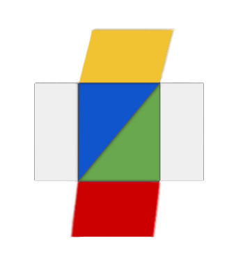

# The PCCR App Framework

 

This project contains the reference implementation for the **P** age
 **C** ube **C** ontent **R** epresentation (PCCR) App Framework.

## Further Material

The following resorces can be accessed [here](https://pccr-website.web.app/).

* Manual [en]
* Benuterhandbuch [de]
* Styleguide
* Technical Documentation

## Directory Structure

This repository contains the software for the consumer and the client applications.
Additionally, resources for creating the testing and documentation environments are included.

    .
    ├── __app-client__                              # __The software for the consumer application.__           
    │    ├── __assets__                             # *Visual Assets.*
    │    │    ├── de.png                            # German flag
    │    │    ├── en.png                            # British flag
    │    │    ├── interreg.png                      # the interreg logo
    │    │    ├── maskable_icon.png                 # Maskable PCCR logo
    │    │    ├── pccr.png                          # PCCR logo
    │    │    ├── pccr_apple.png                    # PCCR logo for iPhone
    │    │    └── visit.png                         # the visit logo
    │    ├── __templates__                          # *The Templates for the Framework Pages.*
    │    │    ├── __admission__                     # The 'admission' page
    │    │    │    └── basic.layout.html            #
    │    │    ├── __appmeta__                       # The 'appmeta' page
    │    │    │    └── basic.layout.html            #
    │    │    ├── __event__                         # The 'event' page
    │    │    │    └── basic.layout.html            #
    │    │    ├── __hours__                         # The 'hours' page
    │    │    │    └── basic.layout.html            #
    │    │    ├── __info__                          # The 'info' page
    │    │    │    └── basic.layout.html            #
    │    │    ├── __legal__                         # The 'legal' page
    │    │    │    └── basic.layout.html            #
    │    │    ├── __object__                        # The 'object' page
    │    │    │    ├── full.layout.html             #
    │    │    │    ├── image.layout.html            #
    │    │    │    ├── info.layout.html             #
    │    │    │    └── text.layout.html             #
    │    │    ├── __person__                        # The 'person' page
    │    │    │    ├── basic.layout.html            #
    │    │    │    └── image.layout.html            #
    │    │    ├── __place__                         # The 'place' page
    │    │    │    └── basic.layout.html            #
    │    │    ├── __question__                      # The 'question' page
    │    │    │    ├── image.layout.html            #
    │    │    │    └── text.layout.html             #
    │    │    ├── __quiz__                          # The 'quiz' page
    │    │    │    └── basic.layout.html            #
    │    │    ├── __room__                          # The 'room' page
    │    │    │    ├── indoor.layout.html           #
    │    │    │    └── outdoor.layout.html          #
    │    │    └── __text__                          # The 'text' page
    │    │         └── basic.layout.html            #
    │    ├── .gitignore                             # [gitignore file]
    │    ├── analytics.js                           # [script] for the consumer analytics.
    │    ├── archive.js                             # script to archive current application
    │    ├── archive_showcase.html                  # show archived *.pccr applications
    │    ├── dash-item.class.js                     # the list item
    │    ├── dash-item.template.html                # [template] for the list item.
    │    ├── favicon.ico                            # [favicon]
    │    ├── firebase.json                          # firebase hosting information
    │    ├── home.html                              # [app] the main app view
    │    ├── index.html                             # [landing] the list view
    │    ├── labels.json                            # the text labels of the app
    │    ├── list-script.js                         # [script] for the list view.
    │    ├── list-style.css                         # [stylesheet] for the list view.
    │    ├── manifest.json                          # manifest
    │    ├── package-lock.json                      # [Node package file]
    │    ├── package.json                           # [Node package file]
    │    ├── pccr.config.json                       # The PCCR configuration file.
    │    ├── robots.txt                             # [robots.txt] avoiding web crawling.
    │    ├── script.js                              # [script] for the main application.
    │    ├── style.css                              # [stylesheet] for the main application.
    │    └── sw_cache_pages.js                      # ServiceWorker for providing resorces offline.
    ├── __app-framework__                           # __The software for the creator application.__
    │    ├── __app-editor__                         # *The App Editor.*
    │    │    ├── app-editor.css                    #
    │    │    ├── app-editor.js                     #
    │    │    ├── connector.js                      #
    │    │    ├── cube-preview.template.html        #
    │    │    ├── editor-page.class.js              #
    │    │    ├── editor-page.template.html         #
    │    │    ├── page-item.class.js                #
    │    │    └── page-item.template.html           #
    │    ├── __area-editor__                        # *The Area Editor.*
    │    │    ├── area-editor.css                   #
    │    │    └── area-editor.js                    #
    │    ├── __cards__                              # *Card Elements.*
    │    │    ├── __data__                          #
    │    │    │    ├── __lang__                     #
    │    │    │    │    ├── de.json                 #
    │    │    │    │    └── en.json                 #
    │    │    │    ├── nav-card-doku.json           #
    │    │    │    ├── page-card-advanced.json      #
    │    │    │    ├── page-card-basic.json         #
    │    │    │    └── page-card-doku.json          #
    │    │    ├── __elements__                      #
    │    │    │    └── page-card.class.js           #
    │    │    ├── __styles__                        #
    │    │    │    ├── cards.css                    #
    │    │    │    ├── nav-card.css                 #
    │    │    │    └── page-card.css                #
    │    │    └── __templates__                     #
    │    │         ├── nav-card.html                #
    │    │         └── page-card.html               #
    │    ├── __dashboard__                          # *The Dashboard.*
    │    │    ├── dash-item.class.js                #
    │    │    ├── dash-item.template.html           #
    │    │    ├── dashboard.css                     #
    │    │    └── dashboard.js                      #
    │    ├── __forms__                              # *The Form Elements.*
    │    │    ├── __data__                          #
    │    │    │    ├── __lang__                     #
    │    │    │    │    ├── de.json                 #
    │    │    │    │    └── en.json                 #
    │    │    │    ├── admission.schema.json        #
    │    │    │    ├── app.schema.json              #
    │    │    │    ├── appmeta.schema.json          #
    │    │    │    ├── basic.schema.json            #
    │    │    │    ├── cube.schema.json             #
    │    │    │    ├── event.schema.json            #
    │    │    │    ├── hours.schema.json            #
    │    │    │    ├── info.schema.json             #
    │    │    │    ├── object.schema.json           #
    │    │    │    ├── person.schema.json           #
    │    │    │    ├── place.schema.json            #
    │    │    │    ├── question.schema.json         #
    │    │    │    ├── quiz.schema.json             #
    │    │    │    ├── room.schema.json             #
    │    │    │    └── text.schema.json             #
    │    │    ├── __elements__                      #
    │    │    │    ├── boolean-input.class.js       #
    │    │    │    ├── date-input.class.js          #
    │    │    │    ├── file-input.class.js          #
    │    │    │    ├── location-input.class.js      #
    │    │    │    ├── number-input.class.js        #
    │    │    │    ├── text-input.class.js          #
    │    │    │    └── time-input.class.js          #
    │    │    ├── __styles__                        #
    │    │    │    ├── boolean-input.css            #
    │    │    │    ├── date-input.css               #
    │    │    │    ├── form-elements.css            #
    │    │    │    ├── image-input.css              #
    │    │    │    ├── location-input.css           #
    │    │    │    ├── number-input.css             #
    │    │    │    ├── text-input.css               #
    │    │    │    └── time-input.css               #
    │    │    ├── __templates__                     #
    │    │    │    ├── boolean-input.html           #
    │    │    │    ├── date-input.html              #
    │    │    │    ├── image-input.html             #
    │    │    │    ├── location-input.html          #
    │    │    │    ├── number-input.html            #
    │    │    │    ├── string-input.html            #
    │    │    │    ├── text-input.html              #
    │    │    │    └── time-input.html              #
    │    │    └── basicFormElement.class.js         #
    │    ├── __preview-phone__                      # *The Preview Phone Element.*
    │    │    ├── __templates__                     #
    │    │    │    ├── __admission__                #
    │    │    │    │    ├── admission.kss.css       #
    │    │    │    │    └── basic.layout.html       #
    │    │    │    ├── __appmeta__                  #
    │    │    │    │    ├── appmeta.kss.css         #
    │    │    │    │    └── basic.layout.html       #
    │    │    │    ├── __event__                    #
    │    │    │    │    ├── event.kss.css           #
    │    │    │    │    └── basic.layout.html       #
    │    │    │    ├── __hours__                    #
    │    │    │    │    ├── hours.kss.css           #
    │    │    │    │    └── basic.layout.html       #
    │    │    │    ├── __info__                     #
    │    │    │    │    ├── info.kss.css            #
    │    │    │    │    └── basic.layout.html       #
    │    │    │    ├── __media__                    #
    │    │    │    │    ├── media.kss.css           #
    │    │    │    │    └── basic.layout.html       #
    │    │    │    ├── __object__                   #
    │    │    │    │    ├── object.kss.css          #
    │    │    │    │    ├── full.layout.html        #
    │    │    │    │    ├── image.layout.html       #
    │    │    │    │    ├── info.layout.html        #
    │    │    │    │    └── text.layout.html        #
    │    │    │    ├── __person__                   #
    │    │    │    │    ├── person.kss.css          #
    │    │    │    │    ├── basic.layout.html       #
    │    │    │    │    └── image.layout.html       #
    │    │    │    ├── __place__                    #
    │    │    │    │    ├── place.kss.css           #
    │    │    │    │    └── basic.layout.html       #
    │    │    │    ├── __question__                 #
    │    │    │    │    ├── question.kss.css        #
    │    │    │    │    ├── image.layout.html       #
    │    │    │    │    └── text.layout.html        #
    │    │    │    ├── __quiz__                     #
    │    │    │    │    ├── quiz.kss.css            #
    │    │    │    │    └── basic.layout.html       #
    │    │    │    ├── __room__                     #
    │    │    │    │    ├── room.kss.css            #
    │    │    │    │    ├── indoor.layout.html      #
    │    │    │    │    └── outdoor.layout.html     #
    │    │    │    └── __text__                     #
    │    │    │         ├── text.kss.css            #
    │    │    │         └── basic.layout.html       #
    │    │    ├── basic.screen.html                 #
    │    │    ├── marvel.device.html                #
    │    │    ├── preview-phone.class.jsl           #
    │    │    └── preview-phone.css                 #
    │    ├── __quiz-editor__                        # *The Quiz Editor.*
    │    │    ├── quiz-editor.css                   #
    │    │    └── quiz-editor.js                    #
    │    ├── __util__                               # *Utilities.*
    │    │    ├── __assets__                        #
    │    │    │    ├── de.png                       #
    │    │    │    ├── en.png                       #
    │    │    │    ├── interreg_logo.png            #
    │    │    │    ├── pccr_logo.png                #
    │    │    │    ├── pccr_logo_white.png          #
    │    │    │    └── visit_logo.png               #
    │    │    ├── __data__                          #
    │    │    │    ├── __lang__                     #
    │    │    │    │    ├── de.png                  #
    │    │    │    │    └── en.png                  #
    │    │    │    └── fontawesome.json             #
    │    │    ├── __dependency/json__               #
    │    │    │    ├── ajv.min.js                   #
    │    │    │    ├── json-schema-draft-04.json    #
    │    │    │    ├── json-schema-draft-06.json    #
    │    │    │    └── json-schema-draft-07.json    #
    │    │    ├── __docu__                          #
    │    │    │    ├── __editor__                   #
    │    │    │    │    ├── editor.css              #
    │    │    │    │    └── editor.html             #
    │    │    │    └── __frameworkScreen__          #
    │    │    │         ├── frameworkScreen.css     #
    │    │    │         └── frameworkScreen.html    #
    │    │    ├── __scripts__                       #
    │    │    │    ├── click.util.js                #
    │    │    │    ├── data.util.js                 #
    │    │    │    ├── drag-list.util.js            #
    │    │    │    ├── glossary.util.js             #
    │    │    │    ├── language.util.js             #
    │    │    │    ├── preview-phone.util.js        #
    │    │    │    └── ui.util.js                   #
    │    │    └── __style__                         #
    │    │         ├── devices.min.css              #
    │    │         ├── editor.css                   #
    │    │         └── tabs.css                     #
    │    ├── README.md                              #
    │    ├── favicon.ico                            #
    │    ├── home.html                              #
    │    ├── master-styles.css                      #
    │    ├── style.css                              #
    │    └── test_image.jpg                         #
    ├── __manual__                                  #  __The user manual resources.__
    │    ├── __assets__                             # *The Visual Assets ..*
    │    │    ├── __kss__                           # *.. for the styleguide*
    │    │    │    ├── elements_schematics.PNG      #
    │    │    │    ├── erd_card.PNG                 #
    │    │    │    ├── erd_input.PNG                #
    │    │    │    ├── erd_screen.PNG               #
    │    │    │    ├── mvvm_overview.PNG            #
    │    │    │    ├── sequence_input.png           #
    │    │    │    └── test_image.jpg               #
    │    │    └── *further image files*             # *.. for the manual*
    │    ├── __de__                                 # *German Manual*
    │    │    └── index.html                        #
    │    ├── __en__                                 # *English Manual*
    │    │    └── index.html                        #
    │    ├── favicon.ico                            # [favicon]
    │    ├── index.html                             # [documentation overview]
    │    └── manual.css                             # [stylesheet]
    ├── __test__                                    # __The testing resources.__
    │    ├── __app-framework/util/scripts__         #   
    │    │    └── test.util.js                      #   
    │    ├── e2e.js                                 #   
    │    ├── index.html                             #
    │    └── nightwatch.js                          #
    ├── .eslintrc.json                              # [es lint configuration]
    ├── .gitignore                                  # [gitignore]
    ├── KSS-HOME.md                                 # The styleguide landing page.
    ├── LICENSE.md                                  # [license]
    ├── MANUAL.bat                                  # open the documentation overview.
    ├── debug.log                                   # [!delete!]
    ├── index.html                                  # the login page.
    ├── jsdoc.json                                  # the jsdoc configuration.
    ├── jsdoc.style.css                             # [stylesheet] for jsdoc
    ├── kss-script.js                               # [script] for additional styleguide functionality.
    ├── kss-styles.css                              # [stylesheet] for the styleguide.
    ├── kss.json                                    # the styleguide configuration.
    ├── login.js                                    # [script] for the login page.
    ├── nightwatch.conf.js                          # [nightwatch]
    ├── nightwatch.json                             # [nightwatch]
    ├── package-lock.json                           # [Node package file]
    ├── package.json                                # [Node package file]
    ├── pccr.config.json                            # the pccr configuration file.
    ├── style.css                                   # [stylesheet] for the login page.
    └── README.md                                   # [This file.]    
   
