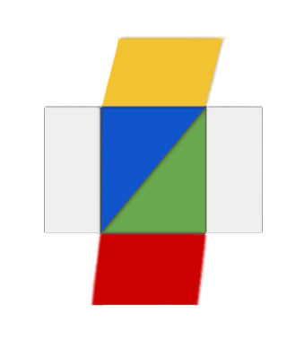

# The PCCR App Framework

<br>

This project contains the reference implementation for the **P** age
 **C** ube **C** ontent **R** epresentation (PCCR) App Framework.


## Getting Started

These instructions will get you a copy of the project
up and running on your local machine for development and testing purposes.

Check the [manual](/manual/en/) for detailed information
on how to deploy the project on a live system.


### Prerequisites

1. You will need to have node.js available on your system.
    + Download [here](https://nodejs.org/en/download/).

2. You will need access to the Google Cloud Platform.
    + Register [here](https://cloud.google.com/).

3. This implementation is developed and tested for the Chrome browser.
    + Download [here](https://www.google.com/chrome/).

3. In the Chrome browser install the "Web Server for Chrome" Extension.
    + Access [here](https://chrome.google.com/webstore/detail/web-server-for-chrome/ofhbbkphhbklhfoeikjpcbhemlocgigb).


### Installing

These steps are necessary to start the development process:

*Step 1:* Clone the repository

```
> git clone https://github.com/hebrusonline/pccr_login.git
```

and move in the project folder

```
> cd pccr_login
```

*Step 2:* Install node modules

```
> npm install
```

*Step 3:* Fill in your API information (see the manual for details).

Enter the necessary information for both FireBase and Maps APIs.


This should give you access to a blank system
that persists it's data using the specified FireBase.


## Built With

Purely powered by [HTML5](https://www.w3.org/html/logo/).

Backend by Google through [Firebase](https://firebase.google.com/).

Uses the Google [Maps API](https://developers.google.com/maps/documentation/).

## Documentation

**API documentation**

*JavaScript*
* The JS documentation follows the
[JSDoc](https://devdocs.io/jsdoc/about-getting-started)
API documentation generator.
  * The GitHub project can be found [here](https://github.com/jsdoc/jsdoc).

```
install via: > npm install jsdoc --save-dev
```

* The template used for the visual representation is
[pixi](https://www.npmjs.com/package/@pixi/jsdoc-template).

```
install via: > npm install @pixi/jsdoc-template --save-dev
```

* To update the documentation call:

```
> node_modules/jsdoc/jsdoc.js -c jsdoc.json
```

* or use npm:

```
> npm run jsdoc
```

***

*Cascading Style Sheets*
* The CSS documentation follows the
[kss-node](https://www.npmjs.com/package/kss).
style guide generator.
  * The GitHub project can be found
  [here](https://github.com/kss-node/kss-node).

```
install via: > npm install kss --save-dev
```

* The template used for the visual representation is
[niepsuj](https://github.com/niepsuj/kss).

```
install via: > npm install niepsuj-kss-template --save-dev
```
* To resolve path/file name conflicts:
[github](https://github.com/kss-node/kss-node/issues/439#issuecomment-351442297).

To load the correct screen markup files, check the file:
  * node_modules/kss/builder/base/handlebars/kss_builder_base_handlebars.js
  * and change line 137 to: return filename;


* To update the documentation call:

```
>  node_modules/.bin/kss --config kss.json
```

* or use npm:

```
> npm run kss
```

## Testing

*Static Tests*
* Static test are run by
[ESlint](https://eslint.org/docs/user-guide/getting-started).

```
install via: > npm install eslint --save-dev
```

* Configuration via .eslintrc.json extending the
Google JavaScript style guide recommedation
[eslint-config-google](https://github.com/google/eslint-config-google).

```
install via: > npm install eslint-config-google --save-dev
```

***
*Unit & Integration Tests*
* Unit and integration tests can be performed using
[Jasmine](https://jasmine.github.io/2.1/custom_reporter.html).
  * The GitHub project can be found
  [here](https://github.com/jasmine/jasmine).

* For test results access the /test folder via browser or click [here](../test).

* Due to the nature of this project and the underlying MVVM architecute those tests are hardly necessary and just mentioned for the overall completion and full-stack integration.

***
*End2End Tests*
* End to End test are run via [Nightwatch](https://nightwatchjs.org/)

[Get Started](https://nightwatchjs.org/gettingstarted)
[Testing Documentation](https://dev.to/kylessg/step-by-step---writing-e2e-tests-for-your-web-project-4mde)

```
install via: > npm install nightwatch --save-dev
```

```
install via: > npm install chromedriver --save-dev
```

* Chromedriver needs to match your current Chrome version, try to always keep them at the latest version (the '--detect_chromedriver_version' flag, can identify the matching version):

```
$ npm install chromedriver --detect_chromedriver_version --save-dev
```

* The Webserver for Chrome Extension needs to be running and hosting the PCCR root folder.

```
run via: > npm run e2e
```

***

## Author

**Tobias Baumgaertner aka Hebrus**
+ [LinkedIn](https://www.linkedin.com/in/baumgaertnertobias/)
+ [Twitter](https://twitter.com/tobi_baum)
+ [Web](http://www.wi.uni-passau.de)


## License
This project is licensed under the GNU GPLv3 License -
see the [LICENSE.md](../LICENSE.md) file for details.

## Issues
- List of known issues:
  * Google Maps integration leads to some issues with the current iOS.
  * No further issues at this time :)


## Acknowledgments

* [University of Passau](http://www.uni-passau.de/en/).

* [Chair of Information Systems](http://www.wi.uni-passau.de/en/) (Information and IT Service Management)

* The
[ViSIT](http://www.phil.uni-passau.de/dh/projekte/visit/) project.

* The
[Interreg](https://www.interreg-bayaut.net/) program.

## File Documentation Overview

If you examine the jsdoc documentation, the file overview can be found below.
